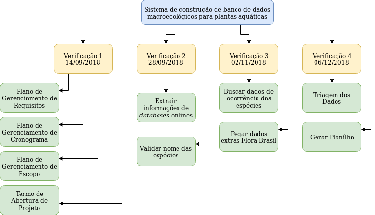

# Plano de Gerenciamento de Requisitos

### Controle de Versões

| Versão |    Data    |            Autores            |   Notas da Revisão    |
| :----: | :--------: | :---------------------------: | :-------------------: |
| 0.0.1  | 21/08/2018 | Cláudia, Igor, Jonas, Letícia | Estrutura Inicial PGR |

## Sumário

1. [Uso do Repositório](#desc)
2. [Ferramenta para Manutenção das Tarefas](#zenhub)
3. [Atualização e Manutenção dos Requisitos](#req)
4. [Declaração de Escopo](#escopo)
5. [Estrutura Analítica do Projeto (EAP)](#eap)

## 1. Uso do Repositório

Será usado o processo do GitFlow, onde cada funcionalidade será implementada em uma branch separada e, ao término da funcionalidade, todas as branches serão integradas à branch de desenvolvimento.

Ao final de cada entrega, a branch de desenvolvimento será integrada à branch principal do repositório.

## 2. Ferramenta para Manutenção das Tarefas

Como forma de manter atualizado o status das tarefas, será utilizada a ferramenta ZenHub.
Esta é responsável por transformar as issues do GitHub em tarefas de desenvolvimento, sendo possível para os desenvolvedores controlar o andamento do cronograma.

Segue o link com instruções para a utilização da ferramenta: 

## 3. Atualização e Manutenção dos Requisitos

Conforme os clientes sentirem a necessidade de novos requisitos, um novo termo será feito com estes.
Cabe aos clientes definirem a prioridade dos novos requisitos com base nos antigos, assim repassar para o time de desenvolvimento.

Com base na prioridade da entrega de funcionalidades, o time definirá quais serão os requisitos que serãoo desenvolvidos para a próxima entrega.

 
## 4. Declaração de Escopo

- **Descrição do Escopo**: O produto pretendido é um sistema capaz i) de validar os nomes das espécies de macrófitas em online databases, trazendo também informações acerca da taxonomia/ecologia/biologia referentes aos nomes aceitos, ii) de congregar informações de registros ocorrências dessas espécies de macrófitas no continente, corrigindo erros e indicando padrões e tendências considerando as bacias hidrográficas Sul-Americanas.
- **Critérios de Aceitação**:
- **Entregas**: Extrair informações de databases onlines; Validar nome das espécies; Buscar dados de ocorrência das espécies; Triagem dos dados.
- **Exclusões**:
- **Restrições**: A maior restrição é o cronograma e o tempo de aprendizado.
- **Premissas**: Os clientes fornecerão informações sobre as regras de negócio.

## 5. Estrutura Analítica do Projeto (EAP)

